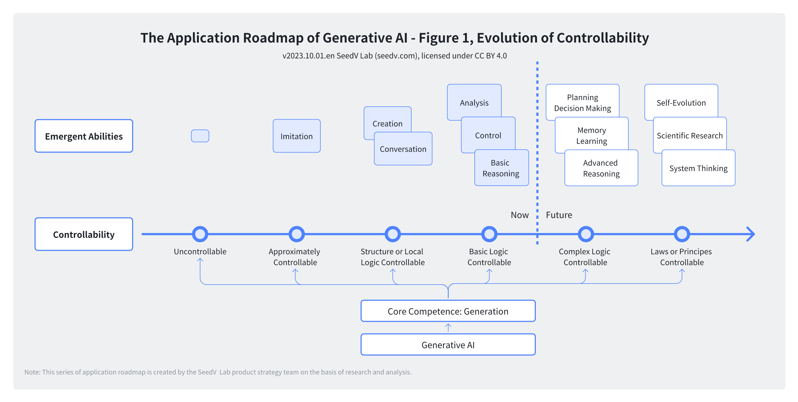
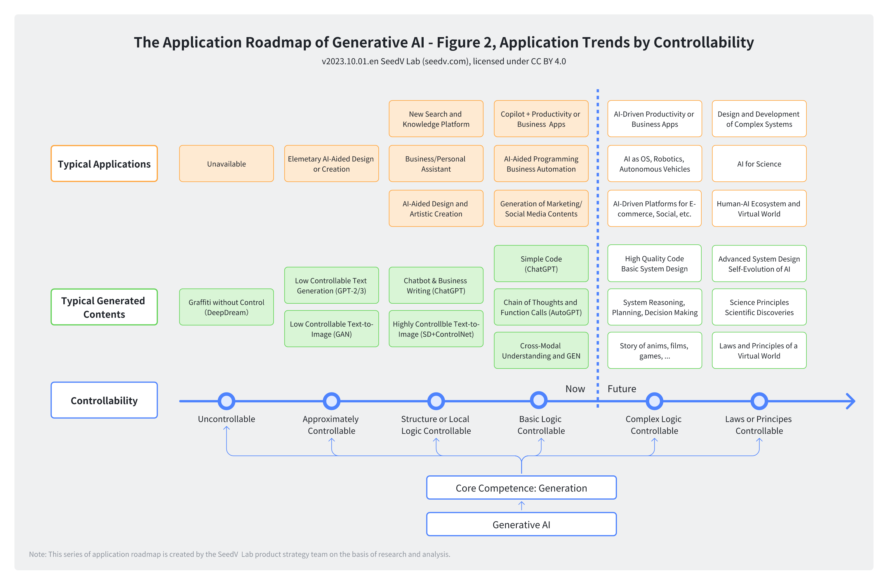
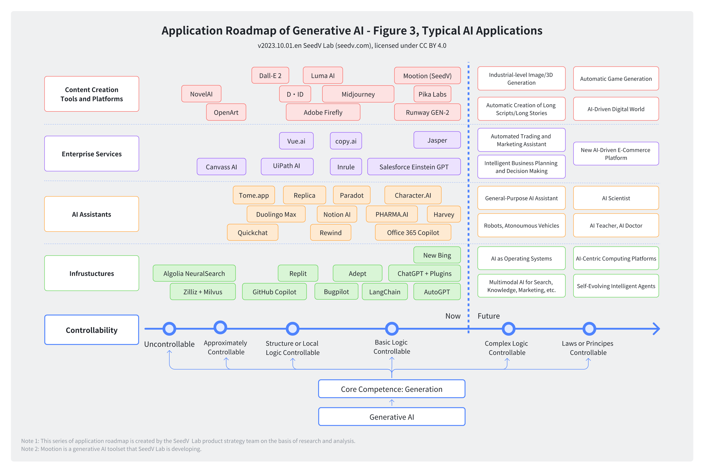
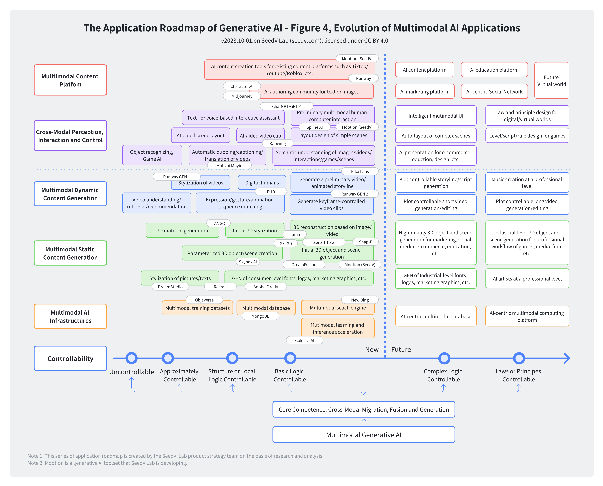

# The Roadmap of Generative AI

The roadmap of generative AI: use cases and applications. This is a translation of [the original Chinese diagrams](./README.md).

## LICENSE

This work is licensed under a
[Creative Commons Attribution 4.0 International License](http://creativecommons.org/licenses/by/4.0/).

## The Application Roadmap of Generative AI - Figure 1, Evolution of Controllability

## The Application Roadmap of Generative AI - Figure 2, Application Trends by Controllability

## Application Roadmap of Generative AI - Figure 3, Typical AI Applications

## The Application Roadmap of Generative AI - Figure 4, Evolution of Multimodal AI Applications

