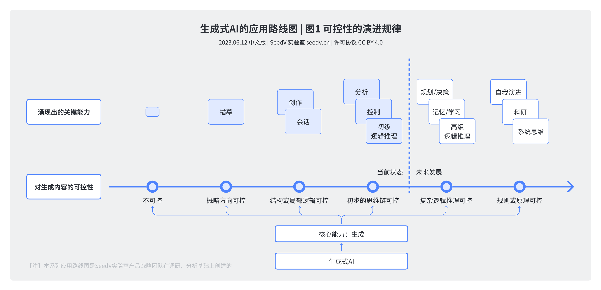
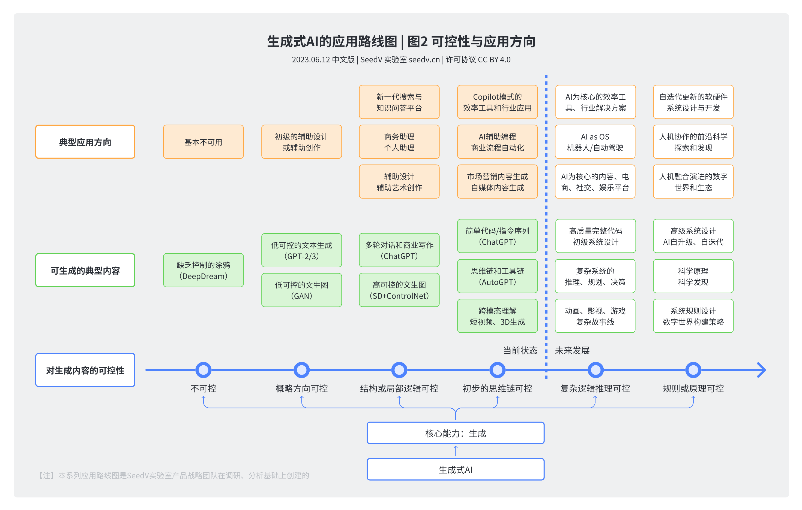
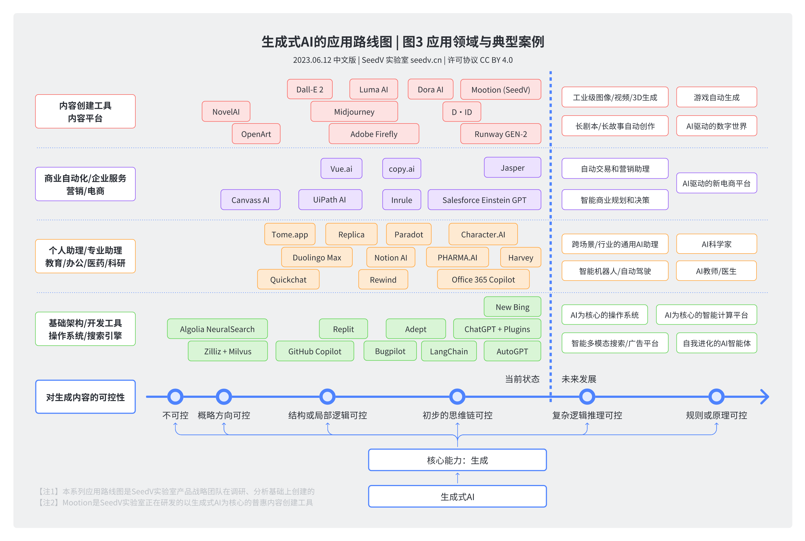
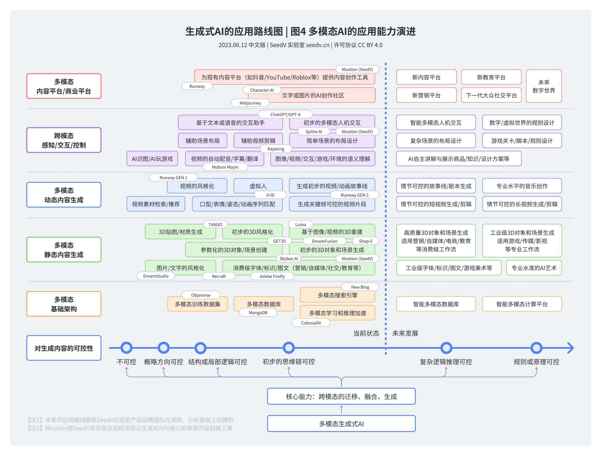
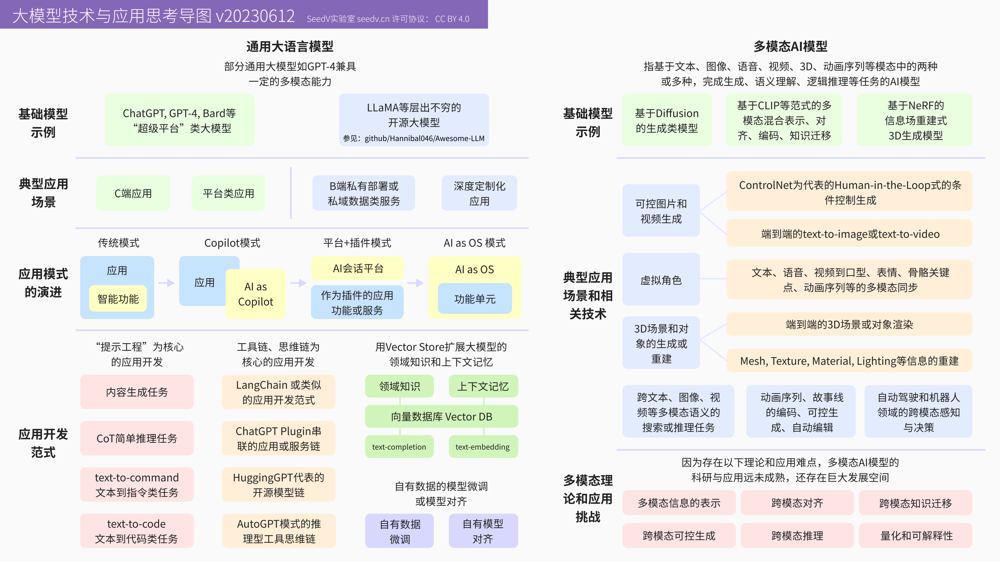

# The Roadmap of Generative AI 生成式AI的应用路线图

The roadmap of generative AI: use cases and applications.

## LICENSE

This work is licensed under a
[Creative Commons Attribution 4.0 International License](http://creativecommons.org/licenses/by/4.0/).

## Localization

The original diagrams and text contents are in Chinese. We are considering
translating them into English.

## 生成式AI的应用路线图 | 图1 可控性的演进规律

## 生成式AI的应用路线图 | 图2 可控性与应用方向

## 生成式AI的应用路线图 | 图3 应用领域与典型案例

## 生成式AI的应用路线图 | 图4 多模态AI的应用能力演进

## 大模型技术与应用思考导图

